# How to Set Up Billing for Copilot Chat Agents (Microsoft 365 Admin Center)

> **Target audience:** IT Admins / Tenant Admins
> **Focus:** Step-by-step admin configuration (no pricing details)
> **Portal:** Microsoft 365 admin center (admin.microsoft.com)

---

## Introduction

Microsoft 365 users without a paid Copilot license can access and use Copilot agents through a pay-as-you-go billing model. As an admin, you configure this entirely from the **Microsoft 365 admin center** — no need to touch the Power Platform admin center for this flow.

This article walks you through the complete setup process, step by step.

---

## Prerequisites

- Global Admin, Billing Admin, or equivalent role in your Microsoft 365 tenant
- An active **Azure subscription** in your tenant (with Owner or Contributor permissions)
- A **resource group** in that Azure subscription (create one in Azure portal if needed)

---

## Step 1: Navigate to Copilot Billing & Usage

In the Microsoft 365 admin center, navigate to **Copilot > Billing & usage**.

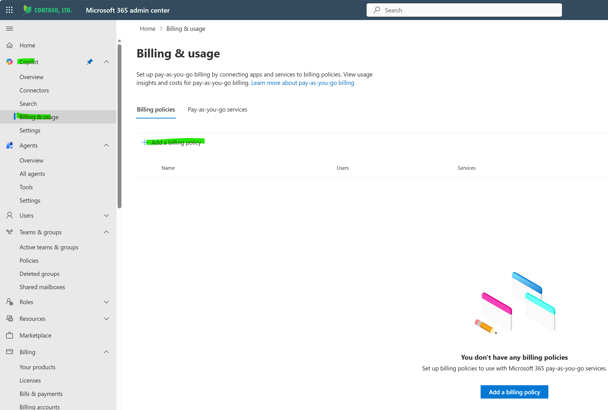

The screenshot shows the **Microsoft 365 admin center** with the left navigation expanded under **Copilot**. The **Billing & usage** section is selected, displaying the main billing management page.

Key elements visible:
- **Left navigation:** Under the **Copilot** section, you can see: Overview, Connectors, Search, and **Billing & usage** (highlighted/selected). Below that is the **Agents** section with Overview, All agents, Tools, and Settings.
- **Main content area:** The **"Billing & usage"** page is displayed with the description: *"Set up pay-as-you-go billing by connecting apps and services to billing policies. View usage insights and costs for pay-as-you-go billing."*
- **Two tabs:** **Billing policies** (active) and **Pay-as-you-go services**.
- **Empty state:** The page shows *"You don't have any billing policies"* with a message to set up billing policies for Microsoft 365 pay-as-you-go services.
- **Action buttons:** There are two ways to start — the **"+ Add a billing policy"** link at the top of the table, or the **"Add a billing policy"** button (red) at the bottom.

Click **"Add a billing policy"** to begin the setup.

---

## Step 2: Fill in Billing Details

After clicking **"Add a billing policy"**, you are taken to the **Add billing policy** wizard. The wizard has four steps shown on the left sidebar:

1. **Billing details** (current step)
2. Choose users
3. Budget
4. Review and finish

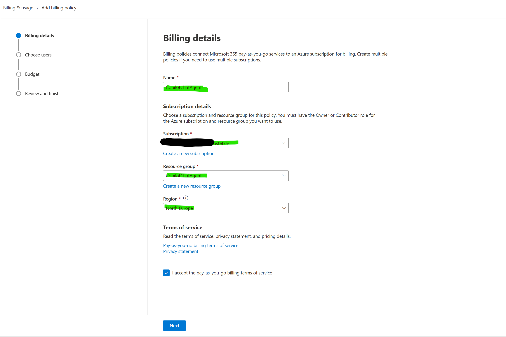

On the **Billing details** page, you need to provide the following information:

- **Name:** Enter a descriptive name for your billing policy (e.g., *"CopilotChatAgents"*). This name will also appear as a Power Platform account resource in your Azure subscription.

**Subscription details** section — here you connect the policy to your Azure infrastructure:

- **Subscription:** Select the Azure subscription you want to bill against. You must have the **Owner** or **Contributor** role on the Azure subscription and resource group you want to use. If you don't have a subscription yet, click *"Create a new subscription"*.
- **Resource group:** Select an existing resource group within that subscription (e.g., *"CopilotChatAgents"*). If you don't have one, click *"Create a new resource group"* — this will take you to the Azure portal to create one.
- **Region:** Select the region for the billing policy (e.g., *"North Europe"*).

**Terms of service** — at the bottom, review the terms of service links:
- Pay-as-you-go billing terms of service
- Privacy statement

Check the box **"I accept the pay-as-you-go billing terms of service"** and click **Next** to proceed.

---

## Step 3: Choose Users

The second step of the wizard is **Choose users**. This controls which users in your organization will have access to the pay-as-you-go services covered by this billing policy.

> **Note:** This option only applies to **Microsoft 365 Copilot pay-as-you-go services**.

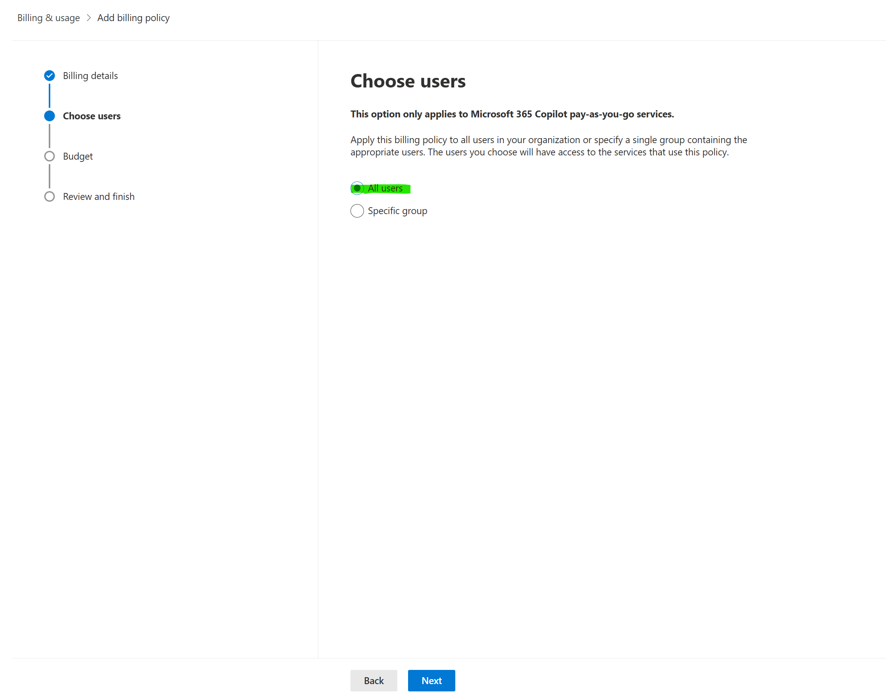

You have two options:

- **All users** (selected by default) — the billing policy applies to every user in your organization. Anyone can use Copilot agents and usage is billed to the linked Azure subscription.
- **Specific group** — restrict access to a single security group. Only members of that group will be able to use the pay-as-you-go services. This is useful if you want to pilot with a smaller group first or control costs by limiting who can trigger agent usage.

Select your preferred option and click **Next** to proceed to the Budget step.

---

## Step 4: Set a Budget

The third step of the wizard is **Budget**. This is optional but highly recommended — it lets you set a spending cap and configure alerts so you don't get surprised by unexpected costs.

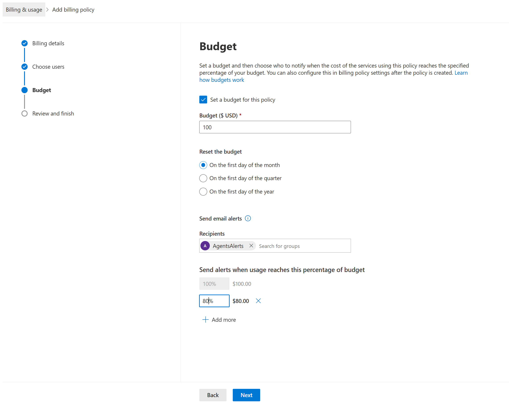

Check **"Set a budget for this policy"** to enable budgeting. Then configure:

- **Budget ($ USD):** Enter the maximum budget amount (e.g., *$100*). This is a notification threshold — it does **not** hard-stop spending, but triggers alerts.

- **Reset the budget:** Choose how often the budget resets:
  - **On the first day of the month** (most common, selected by default)
  - On the first day of the quarter
  - On the first day of the year

- **Send email alerts:**
  - **Recipients:** Add users or groups who should receive cost alerts. In this example, a group called *"AgentsAlerts"* has been added. You can search for additional groups.
  - **Send alerts when usage reaches this percentage of budget:** Configure one or more thresholds. A default alert at **100%** ($100.00) is always present. You can add additional thresholds — for example, **80%** ($80.00) to get an early warning. Click **"+ Add more"** to add extra alert levels.

> **Tip:** Setting an 80% threshold gives your team a heads-up before hitting the full budget, allowing time to investigate or adjust usage.

Click **Next** to proceed to the final review step.

---

## Step 5: Review and Create Policy

The final step is **Review and finish**. This page shows a summary of everything you configured, giving you a chance to verify before creating the policy.

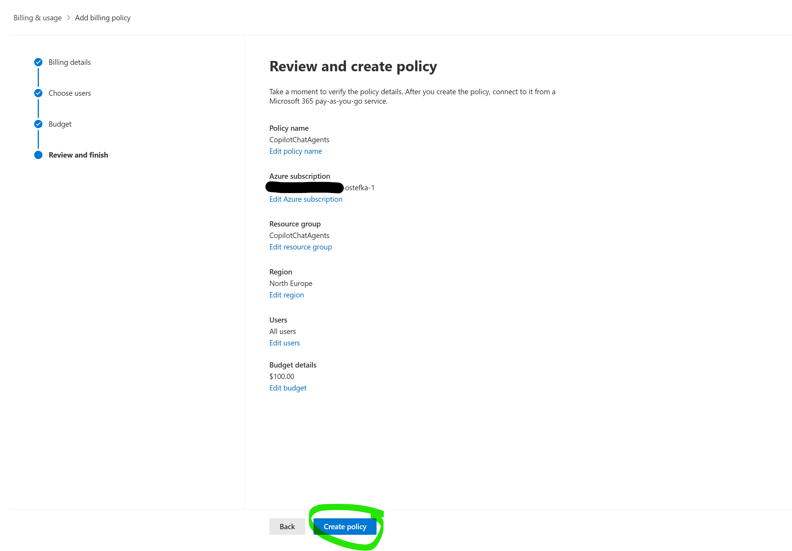

The summary displays:

- **Policy name:** CopilotChatAgents
- **Azure subscription:** The linked Azure subscription (partially redacted for privacy)
- **Resource group:** CopilotChatAgents
- **Region:** North Europe
- **Users:** All users
- **Budget details:** $100.00

Each section has an **"Edit"** link (e.g., *Edit policy name*, *Edit Azure subscription*, *Edit resource group*, *Edit region*, *Edit users*, *Edit budget*) allowing you to go back and modify any specific setting without restarting the entire wizard.

Once you've verified everything is correct, click the **"Create policy"** button to finalize the setup.

---

## Step 6: Adding Another Billing Policy — SharePoint Agents

You can create multiple billing policies for different purposes. In this example, we're adding a second policy specifically for **SharePoint Agents**.

The wizard is the same as before — you arrive at the **Billing details** page with the same four steps.

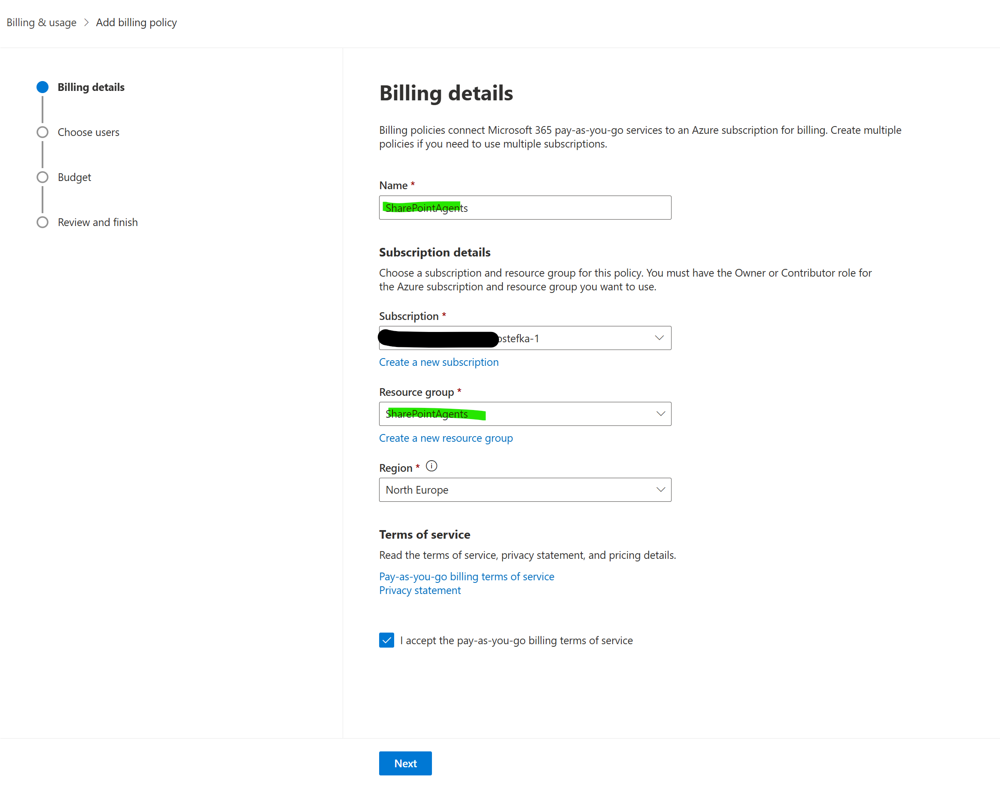

This time, the fields are configured for SharePoint Agents:

- **Name:** *SharePointAgents*
- **Subscription:** Same Azure subscription as before (or a different one if you prefer cost separation)
- **Resource group:** *SharePointAgents* — a dedicated resource group to keep SharePoint agent costs separate from Copilot Chat costs
- **Region:** North Europe
- **Terms of service:** Accepted

> **Tip:** Using separate billing policies with dedicated resource groups is a best practice for cost management. It allows you to clearly track and separate costs between different agent types (e.g., Copilot Chat vs. SharePoint Agents) in your Azure cost analysis.

Click **Next** to continue through the wizard (Choose users, Budget, Review) the same way as the first policy.

---

## Step 7: Billing Policies Overview

After creating your policies, you're back on the **Billing & usage** page. Now instead of the empty state, you can see your billing policies listed.

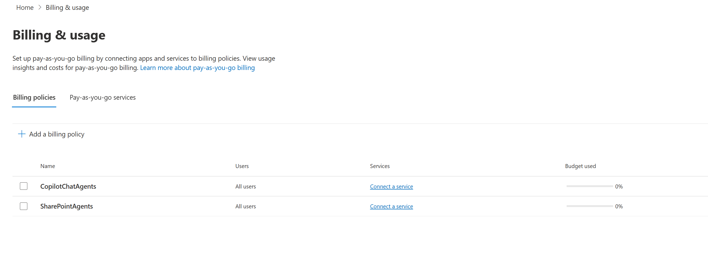

The table shows all created billing policies with the following columns:

| Name | Users | Services | Budget used |
|------|-------|----------|-------------|
| CopilotChatAgents | All users | Connect a service | 0% |
| SharePointAgents | All users | Connect a service | 0% |

Key observations:

- **Services column** shows **"Connect a service"** for both policies — this means the policies are created and linked to Azure, but no pay-as-you-go service has been connected yet. You need to click **"Connect a service"** to activate the billing for a specific service (e.g., Microsoft 365 Copilot Chat, SharePoint agents).
- **Budget used** shows **0%** for both — no usage has been incurred yet.
- You can still add more billing policies using the **"+ Add a billing policy"** link at the top.

The next step is to connect a service to each billing policy.

---

## Step 8: Pay-as-you-go Services Tab

Switch to the **Pay-as-you-go services** tab to see the available services that can be connected to billing policies.

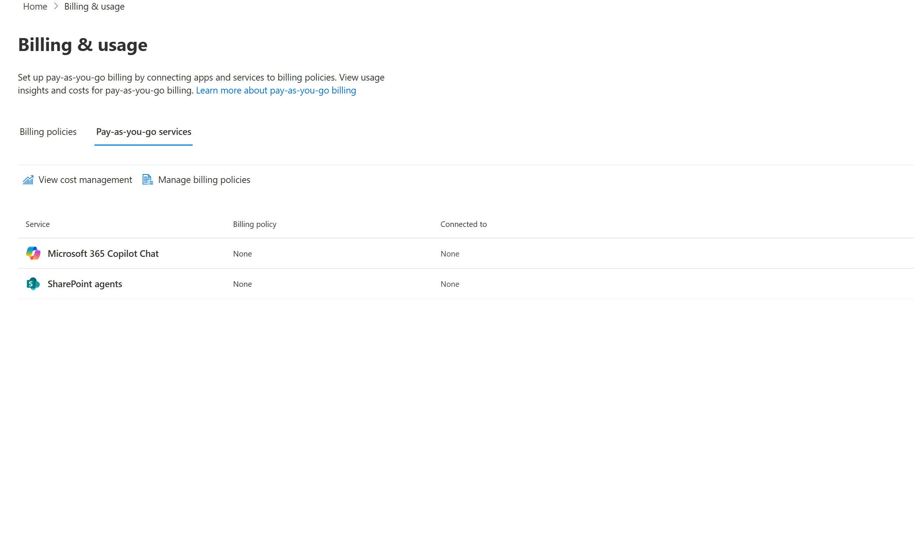

This view shows:

| Service | Billing policy | Connected to |
|---------|---------------|--------------|
| Microsoft 365 Copilot Chat | None | None |
| SharePoint agents | None | None |

Two services are available:
- **Microsoft 365 Copilot Chat** — for Copilot Chat agent usage by M365 users
- **SharePoint agents** — for SharePoint-specific agent usage

Both currently show **"None"** for Billing policy and Connected to — meaning they haven't been linked to any billing policy yet.

At the top of the page, you also have quick links to:
- **View cost management** — opens Azure Cost Management to analyze spending
- **Manage billing policies** — navigates back to the Billing policies tab

Click on a service row to connect it to one of the billing policies you created earlier.

---

## Step 9: Connect a Billing Policy to Microsoft 365 Copilot Chat

After clicking on **Microsoft 365 Copilot Chat** in the services list, a side panel opens: **"Manage billing for Microsoft 365 Copilot Chat"**.

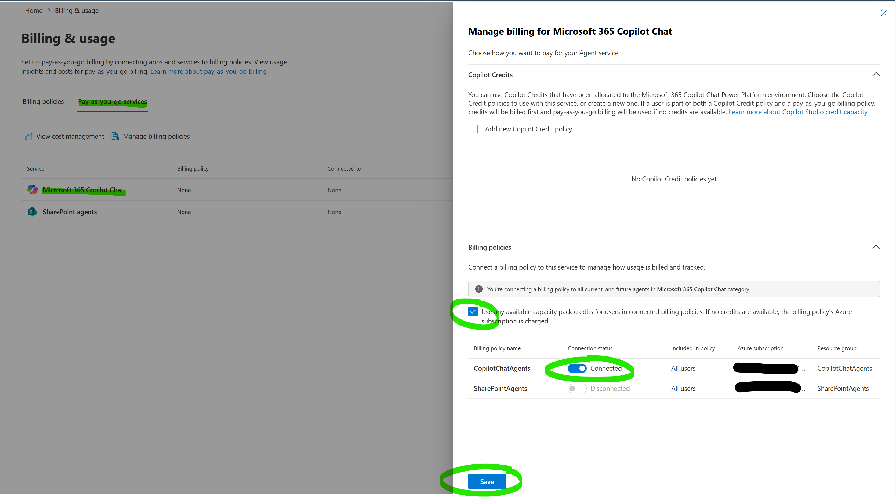

This panel has two sections:

### Copilot Credits
At the top, you can use **Copilot Credits** that have been allocated to the Microsoft 365 Copilot Chat Power Platform environment. You can choose existing Copilot Credit policies or create a new one via **"+ Add new Copilot Credit policy"**. In this example, *"No Copilot Credit policies yet"* is shown — meaning we're relying entirely on pay-as-you-go billing.

> **Important:** If a user is part of both a Copilot Credit policy and a pay-as-you-go billing policy, credits will be billed first and pay-as-you-go billing will be used only if no credits are available.

### Billing policies
This is where you connect the service to your billing policy. Key elements:

- **Info message:** *"You're connecting a billing policy to all current, and future agents in Microsoft 365 Copilot Chat category"* — this means the connection applies broadly to all agents in this category.
- **Checkbox:** *"Use any available capacity pack credits for users in connected billing policies. If no credits are available, the billing policy's Azure subscription is charged."* — this ensures prepaid credits are used first before Azure pay-as-you-go kicks in.

The table lists your billing policies:

| Billing policy name | Connection status | Included in policy | Azure subscription | Resource group |
|---------------------|------------------|-------------------|-------------------|----------------|
| CopilotChatAgents | **Connected** (toggle ON) | All users | ME-M365CPI270401... | CopilotChatAgents |
| SharePointAgents | Disconnected (toggle OFF) | All users | ME-M365CPI270401... | SharePointAgents |

Toggle the **Connection status** to **Connected** for the **CopilotChatAgents** policy and click **Save**.

---

## Step 10: Connect a Billing Policy to SharePoint Agents

Now do the same for the **SharePoint agents** service. Click on **SharePoint agents** in the services list and the side panel opens: **"Manage billing for SharePoint agents"**.

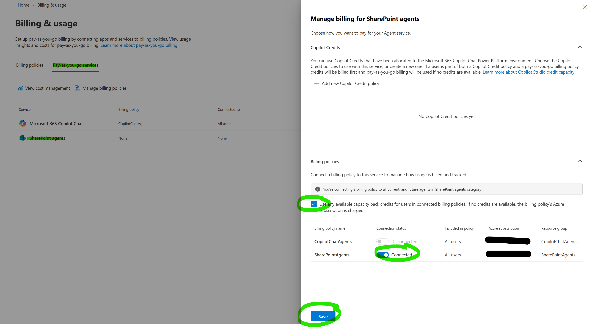

Notice in the background on the left that the **Microsoft 365 Copilot Chat** service now shows **CopilotChatAgents** as its billing policy and **All users** in the Connected to column — confirming the previous step was saved successfully.

The side panel is identical in structure to the previous one, but scoped to **SharePoint agents**:

- **Info message:** *"You're connecting a billing policy to all current, and future agents in **SharePoint agents** category."*
- **Checkbox:** Same option to use available capacity pack credits first before Azure billing kicks in.

This time, toggle the **SharePointAgents** policy to **Connected** and leave CopilotChatAgents as **Disconnected**:

| Billing policy name | Connection status | Included in policy | Azure subscription | Resource group |
|---------------------|------------------|-------------------|-------------------|----------------|
| CopilotChatAgents | Disconnected | All users | ME-M365CPI270401... | CopilotChatAgents |
| SharePointAgents | **Connected** (toggle ON) | All users | ME-M365CPI270401... | SharePointAgents |

Click **Save** to finalize.

> **Key takeaway:** By using separate billing policies for each service, you get clean cost separation in Azure — Copilot Chat usage goes to the *CopilotChatAgents* resource group and SharePoint agent usage goes to the *SharePointAgents* resource group. This makes cost tracking and chargebacks straightforward.

---

## Step 11: Final Configuration — All Services Connected

After saving both connections, the **Pay-as-you-go services** tab now shows the completed configuration.

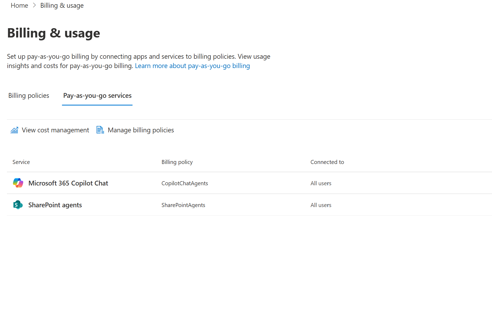

Everything is now fully connected:

| Service | Billing policy | Connected to |
|---------|---------------|--------------|
| Microsoft 365 Copilot Chat | CopilotChatAgents | All users |
| SharePoint agents | SharePointAgents | All users |

Both services are linked to their respective billing policies, and both are available to **All users** in the organization.

**That's it — the setup is complete!** From this point forward:
- Any Copilot Chat agent usage by M365 users will be billed to the Azure subscription under the *CopilotChatAgents* resource group.
- Any SharePoint agent usage will be billed under the *SharePointAgents* resource group.
- You can monitor spending via **"View cost management"** (links to Azure Cost Management) or check the **Billing policies** tab for budget usage percentages.

---

## Summary

To enable pay-as-you-go billing for Copilot Chat and SharePoint agents from the **Microsoft 365 admin center**:

1. Navigate to **Copilot > Billing & usage**
2. Create **billing policies** — one per service/cost center (linking each to an Azure subscription + resource group)
3. Configure **user scope** (all users or a specific group)
4. Set **budgets** and **alert thresholds** to avoid surprise costs
5. Switch to the **Pay-as-you-go services** tab and **connect** each service to its billing policy

> **Best practice:** Use separate billing policies and resource groups per service for clean cost separation and easier Azure cost analysis.

---

## Notes

- This flow is specifically for **Copilot Chat agents** and **SharePoint agents** (M365 users without paid Copilot license)
- Everything is done from **M365 admin center** (admin.microsoft.com), NOT from Power Platform admin center
- The Copilot Studio agents have a different billing setup flow (covered in a separate article)
