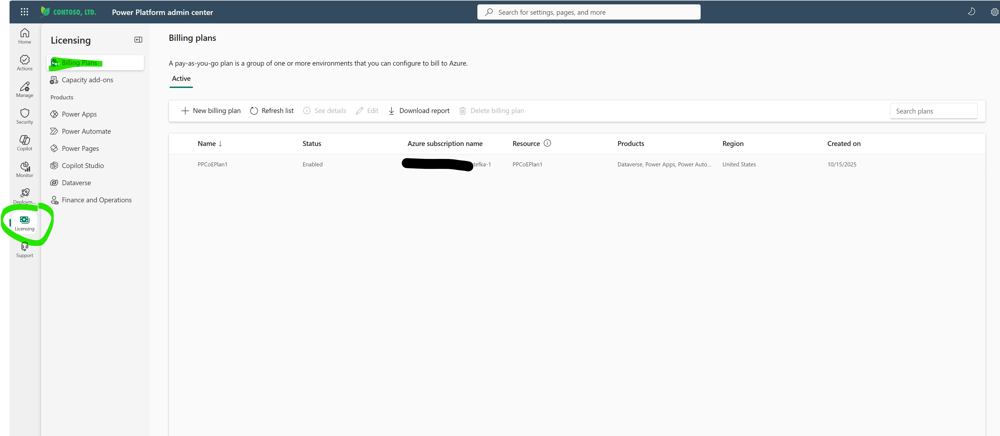
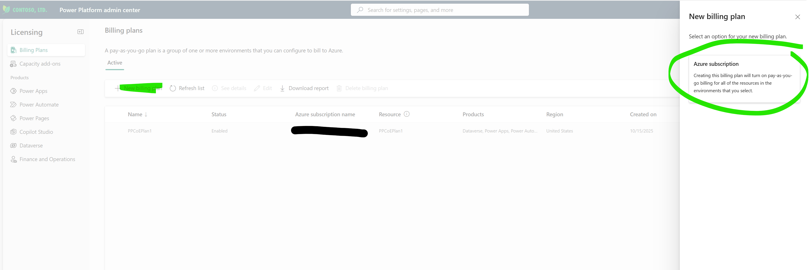
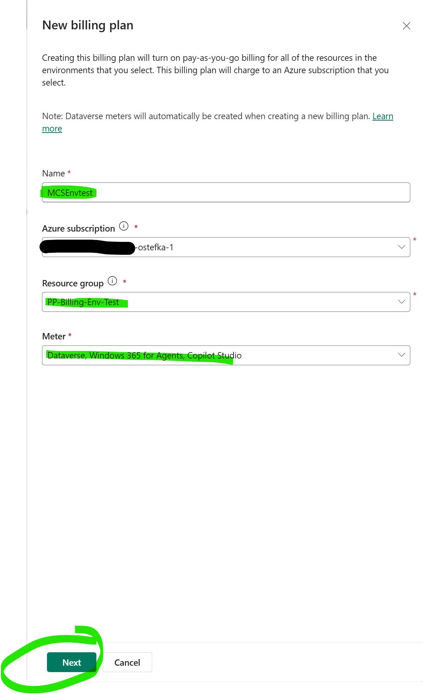
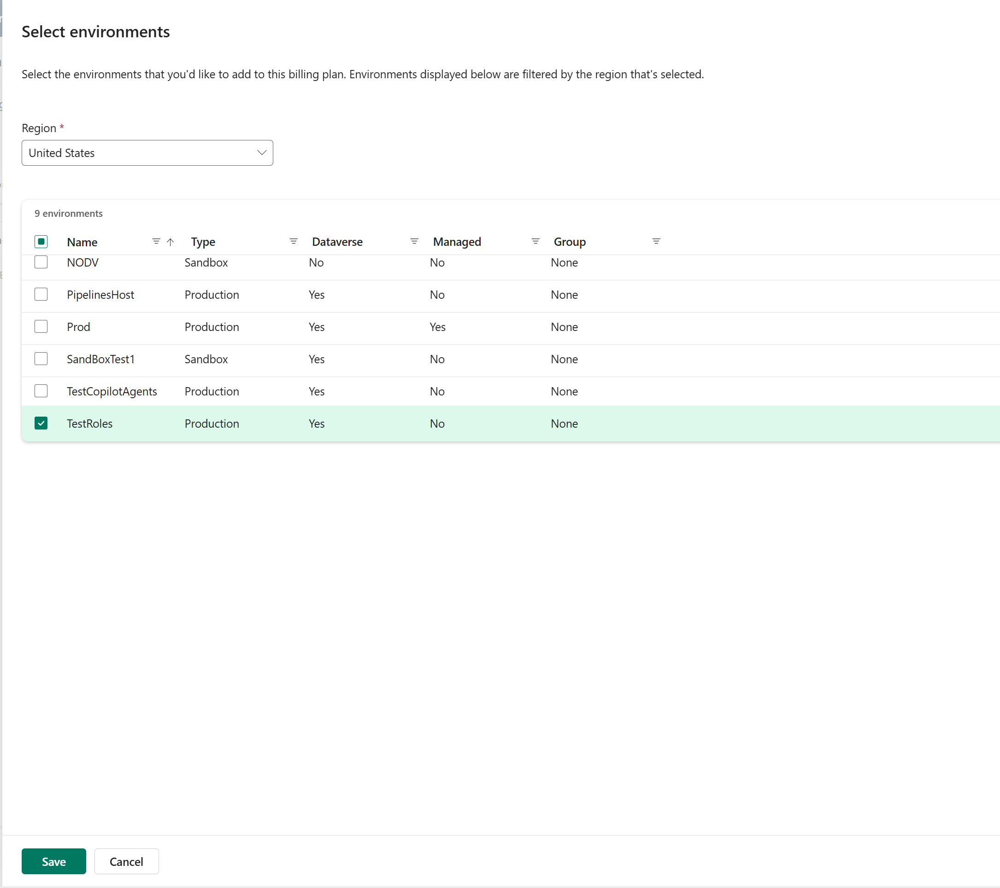
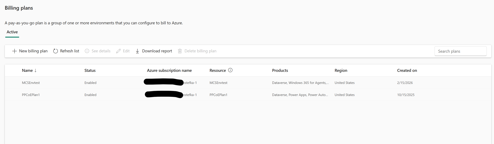

# Jak nastavit fakturaci pro Copilot Studio agenty (Power Platform Admin Center)

> **Cílová skupina:** IT administrátoři / správci tenantů
> **Zaměření:** Konfigurace krok za krokem (bez informací o cenách)
> **Portál:** Power Platform admin center (admin.powerplatform.microsoft.com)

---

## Úvod

Copilot Studio agenti vytvořeni v Power Platform používají odlišné nastavení fakturace než Copilot Chat agenti. Místo Microsoft 365 admin center konfigurujete pay-as-you-go fakturaci z **Power Platform admin center**.

Tento článek Vás provede kompletním procesem nastavení, krok za krokem.

---

## Předpoklady

- Role Power Platform Admin, Global Admin nebo Dynamics 365 Admin
- Aktivní **Azure subscription** ve Vašem tenantovi (s oprávněním Owner nebo Contributor)
- **Resource group** v dané Azure subscription

---

## Krok 1: Přejděte na Licensing > Billing Plans

V **Power Platform admin center** klikněte na **Licensing** v levé navigaci a poté vyberte **Billing Plans**.

Screenshot zobrazuje **Power Platform admin center** s následujícími klíčovými prvky:

- **Levá navigace:** Ikona **Licensing** je zvýrazněna (zakroužkována) v bočním panelu. Pod Licensing je vybrána záložka **Billing Plans**, následovaná *Capacity add-ons*. Níže v sekci **Products** jsou uvedeny: Power Apps, Power Automate, Power Pages, Copilot Studio, Dataverse a Finance and Operations.
- **Hlavní oblast:** Stránka **„Billing plans"** zobrazuje popis: *„A pay-as-you-go plan is a group of one or more environments that you can configure to bill to Azure."*
- **Aktivní záložka:** Zobrazuje existující billing plans v tabulce.
- **Existující plán:** Jeden billing plan již existuje:

| Name | Status | Azure subscription name | Resource | Products | Region | Created on |
|------|--------|------------------------|----------|----------|--------|------------|
| PPCoEPlan1 | Enabled | ME-M365CPI27040012-ostefka-1 | PPCoEPlan1 | Dataverse, Power Apps, Power Auto... | United States | 10/15/2025 |

- **Panel nástrojů:** Možnosti zahrnují *+ New billing plan*, *Refresh list*, *See details*, *Edit*, *Download report*, *Delete billing plan* a vyhledávací pole *Search plans*.

> **Poznámka:** Na rozdíl od M365 admin center zde vidíte, že billing plans v Power Platform mohou pokrývat více produktů (Dataverse, Power Apps, Power Automate atd.) — nejen Copilot Studio.

Klikněte na **„+ New billing plan"** pro vytvoření nového plánu pro Copilot Studio.

---

## Krok 2: Nový billing plan — výběr Azure subscription

Po kliknutí na **„+ New billing plan"** se otevře boční panel: **„New billing plan"**.

Panel Vás vyzve k výběru možnosti pro nový billing plan a zobrazuje jednu volbu:

- **Azure subscription** (zakroužkováno) — *„Creating this billing plan will turn on pay-as-you-go billing for all of the resources in the environments that you select."*

Klikněte na **Azure subscription** a pokračujte.

> **Poznámka:** V M365 admin center pro Copilot Chat agenty jste měli samostatnou možnost „Microsoft 365 Copilot Chat". V Power Platform je k dispozici pouze volba **Azure subscription** — důvodem je, že billing plans v Power Platform pokrývají prostředí a jejich zdroje obecně (Copilot Studio, Dataverse, Power Apps, Power Automate atd.).

---

## Krok 3: Konfigurace detailů billing plánu

Panel **New billing plan** se rozšíří a zobrazí konfigurační formulář.

V horní části panel vysvětluje: *„Creating this billing plan will turn on pay-as-you-go billing for all of the resources in the environments that you select. This billing plan will charge to an Azure subscription that you select."*

> **Poznámka:** Dataverse metry se automaticky vytvoří při založení nového billing plánu.

Vyplňte následující pole:

- **Name:** Popisný název billing plánu (např. *„MCSEnvtest"*).
- **Azure subscription:** Vyberte Azure subscription, vůči které chcete fakturovat. Musíte mít roli Owner nebo Contributor.
- **Resource group:** Vyberte existující resource group (např. *„PP-Billing-Env-Test"*). Pokud žádnou nemáte, vytvořte ji nejprve v Azure portálu.
- **Meter:** Vyberte, které Power Platform produkty/metry zahrnout. V tomto příkladu: *„Dataverse, Windows 365 for Agents, Copilot Studio"*. Jedná se o výběr více položek — zvolíte, které produktové metry se vztahují na tento billing plán.

> **Klíčový rozdíl oproti M365 admin center:** Zde explicitně vybíráte, které **produktové metry** zahrnout do billing plánu. To Vám dává jemnější kontrolu — můžete zahrnout Copilot Studio společně s Dataverse, Power Apps, Power Automate atd., nebo vytvořit dedikovaný plán pouze pro Copilot Studio.

Klikněte na **Next** (zakroužkováno) a přejděte ke kroku výběru prostředí.

---

## Krok 4: Výběr prostředí

Dalším krokem je **Select environments** — zde zvolíte, která Power Platform prostředí budou propojena s tímto billing plánem.

Panel vysvětluje: *„Select the environments that you'd like to add to this billing plan. Environments displayed below are filtered by the region that's selected."*

- **Region:** Vyberte region, kde se Vaše prostředí nacházejí. V tomto testovacím příkladu je vybrán *„United States"*, protože testovací prostředí jsou hostována tam.

> **Důležité pro české zákazníky:** Pokud jsou Vaše prostředí zřízena v Evropě, **musíte vybrat evropský region** (např. *Europe*). Seznam zobrazuje pouze prostředí odpovídající vybranému regionu. Pokud nevidíte Vaše prostředí, změňte nejprve rozbalovací nabídku regionu.

Tabulka zobrazuje všechna dostupná prostředí ve vybraném regionu (v tomto příkladu 9):

| Name | Type | Dataverse | Managed | Group |
|------|------|-----------|---------|-------|
| NODV | Sandbox | No | No | None |
| PipelinesHost | Production | Yes | No | None |
| Prod | Production | Yes | Yes | None |
| SandBoxTest1 | Sandbox | Yes | No | None |
| TestCopilotAgents | Production | Yes | No | None |
| **TestRoles** | **Production** | **Yes** | **No** | **None** |

Zaškrtněte políčko u prostředí, která chcete přidat do billing plánu. V tomto příkladu je vybráno **TestRoles** (produkční prostředí s Dataverse).

> **Tip:** Můžete vybrat více prostředí najednou. Pay-as-you-go je k dispozici jak pro **Production**, tak pro **Sandbox** prostředí. Každé prostředí může být propojeno pouze s jedním billing plánem najednou.

Klikněte na **Save** (zakroužkováno) pro vytvoření billing plánu.

---

## Krok 5: Přehled billing plánů — konfigurace dokončena

Po uložení se vrátíte na stránku **Billing plans**. Nový billing plán se zobrazí vedle existujícího.

Tabulka nyní zobrazuje dva billing plány:

| Name | Status | Azure subscription name | Resource | Products | Region | Created on |
|------|--------|------------------------|----------|----------|--------|------------|
| MCSEnvtest | Enabled | ...fka-1 | MCSEnvtest | Dataverse, Windows 365 for Agents,... | United States | 2/15/2026 |
| PPCoEPlan1 | Enabled | ...fka-1 | PPCoEPlan1 | Dataverse, Power Apps, Power Auto... | United States | 10/15/2025 |

Nově vytvořený plán **MCSEnvtest** je nyní ve stavu **Enabled** a propojený s Azure subscription. Pokrývá metry **Dataverse, Windows 365 for Agents a Copilot Studio**. Odpovídající Azure resource (*MCSEnvtest*) byl automaticky vytvořen v určené resource group.

**Hotovo — nastavení je kompletní!** Od tohoto okamžiku:
- Veškerá spotřeba Copilot Studio agentů v propojených prostředích bude účtována na Azure subscription prostřednictvím pay-as-you-go.
- Plán můžete spravovat pomocí panelu nástrojů: **See details**, **Edit**, **Download report** nebo **Delete billing plan**.
- Pomocí **Download report** můžete exportovat data o spotřebě pro analýzu nákladů.

---

## Shrnutí

Pro aktivaci pay-as-you-go fakturace pro Copilot Studio agenty z **Power Platform admin center**:

1. Přejděte na **Licensing > Billing Plans**
2. Klikněte na **„+ New billing plan"** a vyberte **Azure subscription**
3. Nakonfigurujte plán: název, Azure subscription, resource group a **meter** (vyberte Copilot Studio a další potřebné produkty)
4. Vyberte **region** a **prostředí**, která chcete propojit s billing plánem
5. Klikněte na **Save**

> **Klíčové rozdíly oproti Copilot Chat agentům (M365 admin center):**
> - Billing plans v Power Platform jsou **založené na prostředích** — vybíráte, která prostředí propojit
> - Vybíráte, které **produktové metry** zahrnout (Copilot Studio, Dataverse, Power Apps atd.)
> - V průvodci není samostatný krok „Choose users" ani „Budget" — správa rozpočtu se řeší přes Azure Cost Management
> - Jeden billing plán může pokrývat **více produktů** ve stejných prostředích

---

## Poznámky

- Tento postup je určen specificky pro **Copilot Studio agenty** vytvořené v Power Platform
- Vše se provádí z **Power Platform admin center** (admin.powerplatform.microsoft.com), NIKOLI z M365 admin center
- Copilot Chat agenti a SharePoint agenti mají odlišný postup nastavení fakturace (popsaný v samostatném článku)
